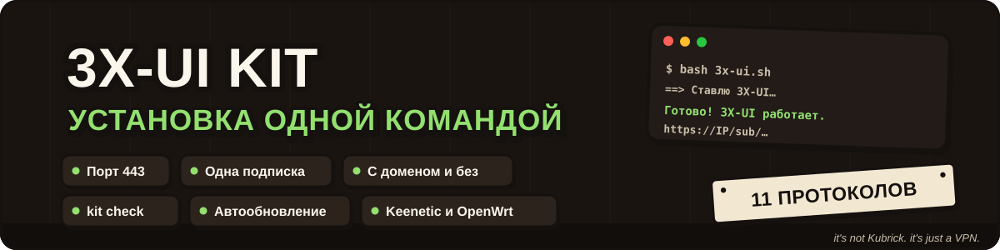

<div align="center">



**Свой VPN-сервер одной командой: 11 протоколов, один порт 443, одна подписка на всё**

[](manuals/3x-ui.md#протоколы)
[](https://github.com/MHSanaei/3x-ui)
[](https://github.com/itsnotkubrick/3X-UI_KIT/commits)

[Возможности](#возможности) · [Установка](#установка) · [Генераторы](#генераторы-конфигов-для-xkeen) · [Полезное](#полезное) · [Поддержать](#поддержать-проект)

</div>

---

> [!TIP]
> **Вышла версия 1.1:** исправления по аудиту безопасности, автообновление только подписанных
> релизов, выбор маскировки (свой домен). [Что нового](https://github.com/itsnotkubrick/3X-UI_KIT/releases/tag/v1.1) ·
> сервер на 1.0 обновляется одной командой:
> ```bash
> curl -fsSL https://raw.githubusercontent.com/itsnotkubrick/3X-UI_KIT/v1.1/scripts/kit.sh -o /usr/local/bin/kit && chmod 755 /usr/local/bin/kit && kit update
> ```

**3X-UI KIT** превращает чистый VPS в готовый VPN-сервер за несколько минут. Скрипт ставит
официальную панель [3X-UI](https://github.com/MHSanaei/3x-ui), настраивает все популярные
протоколы, сертификат и файрвол и выдаёт одну ссылку-подписку. Её можно вставить в любое
приложение – оно само получит подходящие ему протоколы. Домен не нужен.

<div align="center">

</div>

## Возможности

- 🧩 **11 протоколов сразу** – VLESS REALITY, XHTTP, WebSocket, Trojan gRPC, VMess,
  Shadowsocks 2022, Hysteria2, TUIC, AmneziaWG (классика и 3.1) и MTProto для Telegram.
- 🚪 **Всё TCP – через порт 443.** Панель, подписка и протоколы спрятаны за одним портом,
  а на случайный заход сервер показывает обычный сайт.
- 🔗 **Одна подписка на все приложения.** Hiddify, Happ, v2rayN, Karing, Clash Verge и FlClash
  получают свой формат и только те протоколы, которые умеют.
- 👥 **Дополнительные пользователи одной командой** – `kit user add` добавляет пользователя
  сразу во все протоколы с общим лимитом трафика, сроком и числом устройств.
- 🔄 **Обновляется сам, но только подписанными релизами**, а `kit backup` сохраняет
  копию сервера с пользователями и ключами.
- 🔒 **Сертификат Let's Encrypt на IP** выпускается и продлевается сам, панель скрыта на
  случайном пути со случайными логином и паролем.
- ✅ **Проверено настоящими клиентами** – каждый протокол на ядрах Xray, Mihomo и sing-box,
  в том числе с сервером в России: [tests/matrix](tests/matrix/).

## Что понадобится

- VPS с **Ubuntu 22.04/24.04** или **Debian 12/13** и доступом root по SSH
- Свободные порты **443** и **80** – на свежем сервере они свободны

## Установка

Подключитесь к серверу по SSH и выполните:

```bash
bash <(curl -fsSL https://raw.githubusercontent.com/itsnotkubrick/3X-UI_KIT/main/scripts/3x-ui.sh)
```

Через пару минут скрипт покажет адрес панели, логин, пароль и подписку с QR-кодом.

Подробно – подключение приложений, дополнительные пользователи и параметры –
в **[инструкции](manuals/3x-ui.md)**. Нужен только Hysteria2 – есть
[отдельный скрипт](manuals/hysteria2.md).

> [!WARNING]
> Проект создан в образовательных целях. Убедитесь, что ваши действия
> соответствуют законодательству вашей страны.

## Генераторы конфигов для XKeen

Вставьте ссылку на сервер или подписку, отметьте нужные сервисы – и получите
готовый конфиг и одну команду, которая сама положит его на роутер.
Всё считается в браузере, ссылки никуда не отправляются.
Как поставить XKeen на роутер – в [инструкции для Keenetic](manuals/xkeen-keenetic.md).

| | Генератор | Что получится |
|---|---|---|
| ⚙️ | [Xray](https://itsnotkubrick.github.io/3X-UI_KIT/tools/xray/) | `04_outbounds.json` и `05_routing.json`: серверы, выбор сервисов, реклама, свои сайты |
| 🧩 | [Mihomo](https://itsnotkubrick.github.io/3X-UI_KIT/tools/mihomo/) | `config.yaml` с автовыбором сервера, подпиской, Hysteria2, AmneziaWG и веб-панелью |

## Полезное

- [XKeen](https://github.com/jameszeroX/XKeen) и его [вики](https://github.com/jameszeroX/XKeen/wiki) – документация по маршрутизации на Keenetic
- [XKeen UI](https://github.com/zxc-rv/XKeen-UI) – веб-интерфейс для XKeen
- [IP-адреса для AmneziaWG](https://github.com/RockBlack-VPN/ip-address) – актуальные списки от RockBlack

## Поддержать проект

Скрипты и инструкции бесплатные. Донат добровольный – он помогает оплачивать
тестовые серверы и держать скрипты в актуальном состоянии. Спасибо! 💜

| Способ | |
|---|---|
| Российской картой, СБП, Tinkoff Pay | [CloudTips](https://pay.cloudtips.ru/p/d4f9e3d1) |
| Зарубежной картой, Apple Pay, Google Pay | [Buy Me a Coffee](https://buymeacoffee.com/relo.cate) |
| USDT (TRC-20) | `TS83ViXrdezUpp1eFadqj1rBhGLZaba1c1` |
| TON | `UQBchO4XFPwF9MMa_tjXpwqTo8IL2FhUDyllhYuFo8WM-Qbf` |
| Ethereum (ERC-20) | `0xC06F6B3A029d7Ea00705B7028490744e2BC16799` |

## Благодарности

3X-UI KIT построен на работе авторов этих проектов:
[3X-UI](https://github.com/MHSanaei/3x-ui) ·
[Xray-core](https://github.com/XTLS/Xray-core) ·
[Mihomo](https://github.com/MetaCubeX/mihomo) ·
[Hysteria](https://github.com/apernet/hysteria) ·
[AmneziaWG](https://github.com/amnezia-vpn) ·
[XKeen](https://github.com/jameszeroX/XKeen)
