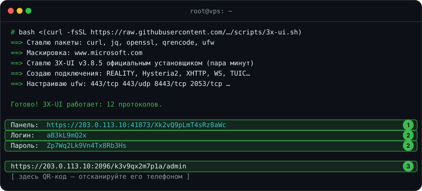

# 🛡 3X-UI: все протоколы одной командой

[← Все инструкции](../README.md#инструкции)

Одна команда ставит панель [3X-UI](https://github.com/MHSanaei/3x-ui), создаёт подключения
на 11 протоколах и выдаёт **одну ссылку-подписку**: приложение само получит
подходящий ему формат и нужные протоколы. Домены не нужны.

**Что делает [скрипт](../scripts/3x-ui.sh):**

- ставит официальную 3X-UI проверенной версии её собственным установщиком
  и ядро Xray, с которым работают все клиенты (Hiddify, Mihomo, v2rayN, Happ);
- выпускает сертификат Let's Encrypt на IP сервера и сам его продлевает;
- прячет панель на случайном порту и пути, со случайными логином и паролем;
- подбирает сайт для маскировки REALITY — с TLS 1.3 и HTTP/2;
- создаёт подключения на всех протоколах из таблицы ниже, генерирует ключи
  и обфускацию AmneziaWG;
- включает единую подписку: Clash Verge и FlClash получают готовый конфиг Mihomo,
  остальные приложения — список ссылок;
- открывает в ufw только нужные порты.

## Протоколы

| Протокол | Порт | Работает в |
|---|---|---|
| VLESS REALITY | 443/tcp | всех приложениях |
| Hysteria2 | 443/udp | всех приложениях |
| VLESS XHTTP + REALITY | 8443/tcp | v2rayN, Happ, Clash Verge, FlClash |
| VLESS WebSocket + TLS | 2053/tcp | всех приложениях |
| Trojan gRPC + TLS | 2083/tcp | всех приложениях |
| VMess WebSocket + TLS | 2087/tcp | всех приложениях |
| Shadowsocks 2022 | 8388/tcp+udp | всех приложениях (на мобильном МТС может блокироваться) |
| TUIC v5 | 8444/udp | Hiddify, Clash Verge, FlClash, NekoBox |
| AmneziaWG | 51821/udp | AmneziaVPN, AmneziaWG, Clash Verge, FlClash |
| AmneziaWG 3.1 | 51822/udp | AmneziaVPN, AmneziaWG, Clash Verge, FlClash |
| MTProto | 8445/tcp | прокси прямо в Telegram (если сервер сам достаёт до Telegram) |

Каждый протокол проверен настоящим подключением на ядрах Xray, Mihomo и sing-box,
в том числе через интернет к серверу в России — стенд лежит в [tests/matrix](../tests/matrix/).

> [!NOTE]
> Обычный WireGuard по умолчанию не ставится: в России его рукопожатие режет DPI,
> а попытки подключения могут привести к блокировке IP сервера. AmneziaWG — тот же WireGuard
> с маскировкой — проходит. Если сервер и пользователи за границей, добавьте `wg` в `--protocols`.

## Что понадобится

- VPS с Ubuntu 22.04/24.04 или Debian 12/13, доступ root по SSH
- Свободные порты **443** и **80** — на свежем сервере они свободны

## Установка

Подключитесь к серверу по SSH и выполните:

```bash
bash <(curl -fsSL https://raw.githubusercontent.com/itsnotkubrick/Reality_Hysteria2/main/scripts/3x-ui.sh)
```

Через пару минут скрипт покажет всё нужное:



1. **Адрес панели** — откройте его в браузере.
2. **Логин и пароль** от панели.
3. **Подписка** — вставьте её в приложение или отсканируйте QR-код.

Всё это, вместе с отдельными ссылками на каждый протокол, сохраняется в `/root/3x-ui.txt`:
посмотреть снова — `cat /root/3x-ui.txt`.

## Подключение

В приложении нажмите **+** → **Импорт из буфера** (или «Добавить подписку») и вставьте ссылку:

| Устройство | Приложение |
|---|---|
| iPhone, iPad | Happ, Streisand, Hiddify |
| Android | Hiddify, Happ, v2rayNG, FlClash |
| Windows, macOS, Linux | Hiddify, v2rayN, Clash Verge |

**AmneziaWG идёт отдельной подпиской** — её адрес заканчивается на `-awg`. Добавьте её в Clash Verge
или FlClash, а в AmneziaVPN импортируйте ссылки `vpn://` из `/root/3x-ui.txt`. В общую подписку
AmneziaWG не попадает: Happ, v2rayN, Karing и Hiddify его не поддерживают.
Для Telegram — ссылка `tg://` оттуда же.

## Добавить друга

В панели откройте **Клиенты → Добавить клиента**, отметьте все подключения и задайте
одинаковый **Subscription ID** — у друга появится своя подписка со всеми протоколами.

## Параметры

| Параметр | Что делает |
|---|---|
| `--protocols reality,hy2,ws` | только выбранные протоколы; `minimal` — только REALITY |
| `--port 8443` | порт REALITY (TCP) и Hysteria2 (UDP) вместо 443 |
| `--cert fullchain.pem --key privkey.pem --host домен` | свой сертификат, например для домена |
| `--sni www.samsung.com` | свой сайт для маскировки REALITY |
| `--no-ufw` | не трогать файрвол |

> [!NOTE]
> Если порт 80 занят, сертификат Let's Encrypt не получить. Тогда скрипт сделает свой
> сертификат и впишет его отпечаток в ссылки, а панель будет доступна через SSH-туннель.
> Подписка в этом режиме работает только изнутри сервера — используйте отдельные ссылки.

## Обслуживание

Управление панелью — официальная команда `x-ui`: перезапуск, логи, обновление, удаление.

```bash
x-ui
```

---

[← Все инструкции](../README.md#инструкции) · [Дальше: 🚀 Hysteria2 →](hysteria2.md)
